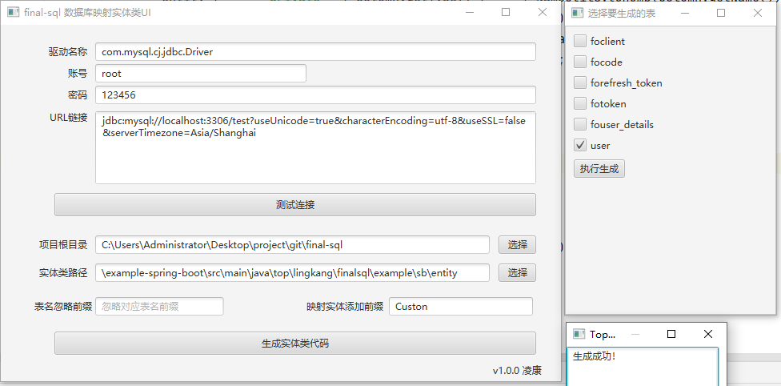

# final-sql

#### 介绍

final-sql 一个轻量级数据库ORM框架。开箱即用，约定大于配置。

### 起源
某天想开发一个bbs社区后台，选择ORM时，用mybatis配置多，hibernate又太重，想用社区某个框架又有bug，那就自己手撸一个轻量级ORM吧。
<br><br>
[wiki: nature 性能对比hibernate、mybatis](https://gitee.com/lingkang_top/final-sql/wikis/nature%20%E6%80%A7%E8%83%BD%E5%AF%B9%E6%AF%94hibernate%E3%80%81mybatis)

## 快速开始
引入依赖
```xml
<dependency>
    <groupId>top.lingkang</groupId>
    <artifactId>final-security-core</artifactId>
    <version>1.0.0</version>
    <scope>system</scope>
    <systemPath>${project.basedir}/lib/final-sql-core-1.0.0.jar</systemPath>
</dependency>

<!--sql-->
<dependency>
    <groupId>mysql</groupId>
    <artifactId>mysql-connector-java</artifactId>
</dependency>
<!--用于配置连接数据库、自动装配DataSource-->
<dependency>
    <groupId>org.springframework.boot</groupId>
    <artifactId>spring-boot-starter-data-jdbc</artifactId>
</dependency>
```
application.properties
```properties
spring.datasource.driver-class-name=com.mysql.cj.jdbc.Driver
spring.datasource.url=jdbc:mysql://localhost:3306/test?serverTimezone=UTC
spring.datasource.username=root
spring.datasource.password=123456
```
### 快速入手
`ps 测试练习专用`
```java
FinalSqlDevDataSource dataSource=new FinalSqlDevDataSource(
        "com.mysql.cj.jdbc.Driver",
        "jdbc:mysql://localhost:3306/test?serverTimezone=UTC",
        "root",
        "123456"
        );
SqlConfig sqlConfig = new SqlConfig(dataSource);
FinalSql finalSql = new FinalSqlManage(sqlConfig);
```

#### spring项目中
```java
@Configuration
public class FinalSqlConfig {
    @Autowired // DataSource 上层应为连接池！
    private DataSource dataSource;

    @Bean
    public FinalSql finalSql() {
        SqlConfig sqlConfig = new SqlConfig(dataSource);
        sqlConfig.setShowSqlLog(true);
        return new FinalSqlImpl<>(sqlConfig);
    }
}
```
#### 定义表映射
```java
@Data
@Table("user")
public class MyUser {
    @Id
    @Column
    private Integer id;
    @Column
    private Integer num;
    @Column
    private String username;
    //@Column
    private String password;
    @Column("create_time")
    private Date createTime;
}
```
## CURD
```shell
@Autowired
private FinalSql finalSql;

// 查询
MyUser user = new MyUser();
List query = finalSql.select(user);
System.out.println(query);
    
// 更新
MyUser user = new MyUser();
user.setId(6);
user.setCreateTime(new Date());
finalSql.update(user);

// 插入
MyUser one = new MyUser();
one.setUsername("lingkang");
one.setCreateTime(new Date());
one.setNum(66);
finalSql.insert(one);

// 删除
MyUser user = new MyUser();
user.setId(6);
finalSql.delete(user)
```

## 对象查询
约定大于配置， 下划线列查询的结果将被自动转化为驼峰命名
```java
// 查询对象列表， 约定大于配置， create_time 在返回结果时将被转化为 createTime 驼峰命名
finalSql.selectForList("select id,username,create_time from user", MyUser.class);

// 查询对象， 约定大于配置， create_time 在返回结果时将被转化为 createTime 驼峰命名
finalSql.selectForObject("select * from user", MyUser.class);

// 查询 Map， 约定大于配置， create_time 在返回结果时将被转化为 createTime 驼峰命名
finalSql.selectForMap("select id,username,create_time from user");

// 查询返回指定行
finalSql.selectForListRow("select * from user", MyUser.class, 2);
```

## 复杂条件
条件主要使用类: **Condition**
```shell
// 删除id为4的数据
finalSql.delete(MyUser.class, new Condition().eq("id", 4));

// in 查询个数
List<Integer> in=new ArrayList<>();
in.add(1);
in.add(5);
return finalSql.selectCount(MyUser.class,new Condition().andIn("id",in));

// 查询一个结果：查询 type=2 并且进行倒序
finalSql.selectOne(new MyUser(), new Condition().eq("type", 222).orderByDesc("id"))

// 复杂自定义
finalSql.select(MyUser.class,new Condition().custom("and id=? and create_time<now()",4))
// select id, num, username, create_time as createTime from user where 1=1 and id=4 and create_time<now()
```

## 事务
```shell
// 开启事务
FinalTransactionHolder.begin();// 开启事务

// 操作数据库逻辑
finalSql.delete(MyUser.class, new Condition().eq("id", 1));
finalSql.delete(MyUser.class, new Condition().eq("id", 2));

// 正常提交事务
FinalTransactionHolder.commit();

// 回滚事务
FinalTransactionHolder.rollback();
```
### spring 项目中
spring 项目中，直接在方法上使用 **@Transactional** 注解即可，因为**final-sql**已经将事务委托给spring，spring会自动装配。（**_约定大于配置_**）
```java
@Transactional
public Object insert() {
    MyUser one = new MyUser();
    one.setUsername("lingkang");
    one.setCreateTime(new Date());
    one.setNum(1);
    finalSql.insert(one);
    if(1==1)
      throw new RuntimeException("回滚事务");
    return one;
}
```

## 其他数据库支持
若是冷门数据库，需要自行添加方言支持，需要实现 **SqlDialect** 接口
<br><br>
默认已经支持的数据库方言:<br>
**Mysql57Dialect** <br>
**PostgreSqlDialect** <br>

## 生成实体类映射
### UI

```java
public static void main(String[] args) {
    String version = System.getProperty("java.version");
    if (!version.substring(0,2).endsWith(".")){
        System.out.println("java ui 不支持jdk8以上版本，jdk8以上版本已经剥离javafx");
        System.exit(0);
    }
    DbToEntityGeneratorUI.main(args);
}
```

